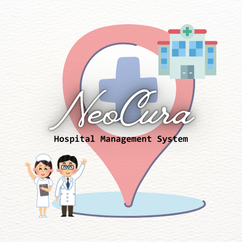

# NeoCura-Hospital-Management-System
<p align="center">
  
</p>

<h1 align="center">NeoCura</h1>

<p align="center">
A comprehensive Hospital Management System built using <b>Python</b>, <b>Streamlit</b>, and <b>MySQL</b>.
</p>

<p align="center">


</p>

---

# 🏥 About NeoCura

NeoCura is a full-stack Hospital Management System designed to simplify hospital administration through an intuitive role-based interface.

The system enables administrators, doctors, nurses, and hospital staff to manage patient records, appointments, billing, prescriptions, medical notes, and analytics from a single platform.

It was built as an end-to-end database management project with emphasis on clean database design, role-based access control, and real-world hospital workflows.

---

# ✨ Features

## 👨‍💼 Administrator

- Dashboard
- Manage doctors
- Manage nurses
- Manage staff
- Manage patients
- Appointment management
- Billing management
- Analytics dashboard
- Secure authentication
- Password management

---

## 👨‍⚕️ Doctor

- View assigned patients
- Patient profiles
- Add new patients
- Write prescriptions
- Mental health notes
- Medical history
- Password management

---

## 👩‍⚕️ Nurse

- View assigned patients
- Record patient vitals
- Add nurse observations
- View appointments
- Password management

---

## 🧑‍💼 Hospital Staff

- Schedule appointments
- Billing management
- Billing follow-ups
- Generate reports
- Dashboard metrics
- Password management

---

# 📊 System Highlights

- Role-Based Authentication
- Session Management
- Login Rate Limiting
- Secure Password Updates
- Dashboard Analytics
- Pagination for Large Tables
- Data Validation
- Medical Records Management
- Billing System
- Appointment Scheduling
- Logging System
- Sample Data Generator
- Responsive Streamlit Interface

---

# 🛠 Tech Stack

| Technology | Purpose |
|------------|----------|
| Python | Backend |
| Streamlit | User Interface |
| MySQL | Database |
| MySQL Connector | Database Connectivity |
| Pandas | Data Processing |
| Altair | Charts & Analytics |
| Faker | Sample Data Generation |

---

# 📂 Project Structure

```
NeoCura/
│
├── NC_Menu.py                  # Main Streamlit Application
├── NC_Module.py                # Backend Database Operations
├── NC_Schema.sql               # Database Schema
├── Random_Data_Generation.py   # Generates Sample Hospital Data
├── NC.png                      # Logo
├── README.md
└── requirements.txt
```

---

# 🗄 Database Design

The project uses MySQL as the backend database.

Major entities include:

- Login Users
- Doctors
- Nurses
- Staff
- Patients
- Appointments
- Prescriptions
- Patient Vitals
- Mental Health Notes
- Nurse Notes
- Billing
- Billing Follow-ups

Relational integrity is maintained using foreign keys.

---

# 🚀 Installation

## Clone Repository

```bash
git clone https://github.com/yourusername/NeoCura.git

cd NeoCura
```

Install dependencies

```bash
pip install -r requirements.txt
```

Create MySQL database

```sql
CREATE DATABASE hospital;
```

Run

```
NC_Schema.sql
```

Update database credentials inside

```
NC_Module.py

Random_Data_Generation.py
```

Run the application

```bash
streamlit run NC_Menu.py
```

---

# 🎲 Sample Data

NeoCura includes a random data generator that automatically populates the database with realistic Indian hospital data.

Generated data includes:

- Doctors
- Nurses
- Staff
- Patients
- Appointments
- Billing Records
- Prescriptions
- Medical Notes
- Contact Information
- Addresses

---

# 📈 Future Improvements

- Password hashing (bcrypt)
- Email notifications
- Medical report upload
- Lab management
- Pharmacy management
- Insurance management
- QR Code patient IDs
- REST API integration
- Cloud deployment
- Docker support

---

# 👩‍💻 Author

**Devanshi Mishra**

GitHub:
https://github.com/Devanshi-08

LinkedIn:
https://www.linkedin.com/in/devanshi-mishra-

---

# 📄 License

This project is licensed under the MIT License.
